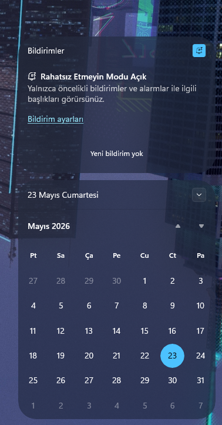
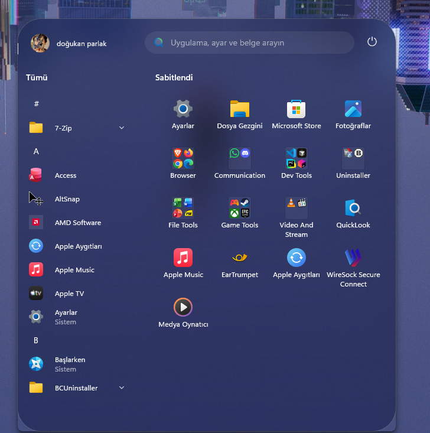
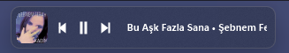
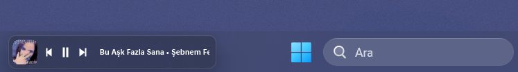

# 🛠️ Windhawk

> **Kısa Açıklama:** Windows programlarına mod yükleyerek görev çubuğu, Explorer, Start menüsü ve daha fazlasını kod yazmadan özelleştiren araç.

1.7.x · Windows 7 SP1–11 · GPL-3.0 / ücretsiz · Sistem özelleştirme

---

## 📌 Genel Bakış

Windhawk, Explorer, görev çubuğu, Start menüsü ve tarayıcı gibi uygulamalara küçük “mod” paketleri enjekte ederek Windows’u kişiselleştirir. Modlar katalogdan tek tıkla kurulur; kaynak kodları açıktır. Registry düzenlemek veya üçüncü taraf “tweak” araçlarıyla uğraşmak yerine mod tabanlı, geri alınabilir bir yol sunar.

---

## ✨ Öne Çıkan Özellikler

- **Mod kataloğu** — Tek tıkla kur, kaldır, güncelle
- **Açık kaynak modlar** — Her modun kaynağı görülebilir
- **Canlı ayar** — Çoğu modda değişiklik anında uygulanır
- **Güvenli geri alma** — Modu kapat veya kaldır; etki kaybolur
- **Geniş Windows desteği** — Windows 7 SP1’den 11’e (modlar genelde Win10/11 odaklı)
- **Geliştirici dostu** — Kendi modunu yazıp paylaşabilirsin

---

## 📥 İndirme ve Kurulum

### Yöntem 1: Resmi Site — Önerilen

1. [ramensoftware.com/windhawk](https://ramensoftware.com/windhawk) veya [windhawk.net](https://windhawk.net) adresine git
2. **Download** ile kurulum dosyasını indir
3. `windhawk_setup.exe` dosyasını **Yönetici olarak çalıştır**

### Yöntem 2: WinGet (Terminal)

```powershell
winget install -e --id RamenSoftware.Windhawk
```

### Yöntem 3: UniGetUI

> UniGetUI açıkken arama çubuğuna **Windhawk** yaz ve kur.

> 💡 WinGet güncellemesi bazen hash uyuşmazlığı verebilir; o durumda resmi siteden indirip üzerine kur.

---

## ⚙️ İlk Kurulum ve Önerilen Ayarlar

1. **UAC onayı:** Kurulum ve çalışma için yönetici izni gerekir — onayla
2. **Servis:** Windhawk arka plan servisi otomatik başlar; sistem tepsisinden eriş
3. **Otomatik güncelleme:** Ayarlar → Updates → **Auto-update mods** aç
4. **Az modla başla:** Önce 1–2 mod kur; sorun çıkarsa hangi modun etkilediğini bulmak kolay olur

> 💡 Mod kurduktan sonra Explorer veya görev çubuğu yeniden başlamazsa bilgisayarı yeniden başlat veya ilgili modu kapat/aç.

---

## 🚀 Temel Kullanım

### Mod kurma

1. Windhawk’ı aç → **Browse for mods** (katalog)
2. Modu ara → açıklamayı oku → **Install**
3. Mod ayarlarını aç → ihtiyacına göre yapılandır → **Save**

### Mod yönetimi


| Sekme / Alan        | İşlev                                     |
| ------------------- | ----------------------------------------- |
| **Browse for mods** | Katalogdan yeni mod keşfet                |
| **Installed mods**  | Kurulu modları aç/kapat, güncelle, kaldır |
| **Settings**        | Güncelleme, gelişmiş seçenekler           |
| **Arama**           | Mod adına göre hızlı filtre               |


### Mod güncelleme

- Otomatik: Ayarlar → Updates → **Auto-update mods**
- Manuel: **Installed mods** → güncelleme olan modda **Update**

### Manuel mod (gelişmiş)

Geliştirici mod dosyası (`.wh.cpp`) varsa: Ayarlar → Advanced → **Load mod from file**

---

## 🔌 Önerdiğim Modlar

Windhawk kataloğunda yüzlerce mod var; aşağıdakiler kişisel kurulumumda kullandıklarım. Her mod Windhawk’ta adıyla aranabilir.

#### İçindekiler

- [1. Better File Sizes in Explorer Details](#mod-1) — Explorer’da okunaklı dosya/klasör boyutu
- [2. Chrome/Edge Scroll Tabs with Mouse Wheel](#mod-2) — Sekme çubuğunda tekerlek ile geçiş
- [3. Taskbar Labels for Windows 11](#mod-3) — Görev çubuğu etiketleri ve birleştirme
- [4. Windows 11 Notification Center Styler](#mod-4) — Bildirim merkezi teması
- [5. Windows 11 Start Menu Styler](#mod-5) — Start menüsü düzeni
- [6. Windows 11 Taskbar Styler](#mod-6) — Görev çubuğu teması
- [7. Taskbar Music Lounge](#mod-7) — Görev çubuğu medya kontrolcüsü
- [8. Taskbar tray system icon tweaks](#mod-8) — Sistem tepsisi ikonları

---

<a id="mod-1"></a>

### 📁 1- Better File Sizes in Explorer Details

Explorer’ın **Details** (ayrıntılar) görünümünde dosya boyutlarını okunaklı gösterir; klasör boyutlarını da gösterebilir. Windows varsayılanında klasör boyutu yoktur ve büyük dosyalar KB cinsinden okunması zordur — bu mod disk temizliği ve dosya yönetimi için pratik bir çözümdür. Detaylar: [windhawk.net/mods/explorer-details-better-file-sizes](https://windhawk.net/mods/explorer-details-better-file-sizes)

#### Ne sağlar?

- **Klasör boyutları** — `Documents: 2.5 GB` gibi toplam boyut
- **Okunaklı format** — `1,234,567 KB` yerine `1.2 GB`
- **IEC birimleri** (isteğe bağlı) — `KiB`, `MiB`, `GiB` (1024 tabanlı)
- **Karışık sıralama** — Boyuta göre dosya ve klasörleri birlikte sıralar

#### Kurulum

1. Windhawk → **Better file sizes** ara → **Install**
2. Explorer’ı **Details** görünümüne al (Görünüm → Ayrıntılar)
3. Mod ayarlarını aşağıya göre yapılandır → **Save**

#### Klasör boyutu — önemli ayar

**Everything ile (önerilen, hızlı)**

1. [Everything](https://www.voidtools.com) kur
2. Everything → Tools → Options → Indexes → **Index file size** ve **Index folder size** aç
3. Mod ayarı: **Enabled via Everything integration**

Klasör boyutları anında gelir; manuel hesaplamadan belirgin şekilde daha hızlıdır.

**Everything yoksa**


| Mod ayarı                        | Davranış                                     |
| -------------------------------- | -------------------------------------------- |
| **Enabled, calculated manually** | Her zaman hesaplar — büyük klasörlerde yavaş |
| **While holding Shift key**      | Sadece Shift basılıyken hesaplar — orta yol  |


> 💡 Everything kullanmıyorsan sürekli manuel hesaplama Explorer’ı yavaşlatabilir; Shift modu daha güvenli tercihtir.

#### Diğer faydalı ayarlar


| Ayar                                           | Kapalı                         | Açık                    |
| ---------------------------------------------- | ------------------------------ | ----------------------- |
| **Use MB/GB for large files**                  | `1,234,567 KB`                 | `1.2 GB`                |
| **Use IEC terms**                              | KB, MB, GB (1000)              | KiB, MiB, GiB (1024)    |
| **Mix files and folders when sorting by size** | Önce klasörler, sonra dosyalar | Boyuta göre karma liste |


#### Ne zaman kullanılır?

**Disk temizliği:** Klasör boyutlarını aç → **Size** sütununa tıkla (büyükten küçüğe) → en büyük klasör/dosyaları bul → gereksizleri sil.

**Dosya yönetimi:** MB/GB formatı ve karışık sıralama ile büyük dosyaları hızlıca tespit et.

---

<a id="mod-2"></a>

### 🌐 2- Chrome/Edge Scroll Tabs with Mouse Wheel

Sekme çubuğunun üzerinde fare tekerleği ile kaydırarak sekmeler arasında geçiş yapmanı sağlar. Çok sekme açan kullanıcılar için `Ctrl+Tab` veya tıklamaya gerek kalmadan hızlı navigasyon sunar. Detaylar: [windhawk.net/mods/chrome-edge-scroll-tabs-with-mouse-wheel](https://windhawk.net/mods/chrome-edge-scroll-tabs-with-mouse-wheel)

#### Ne sağlar?

- **Tekerlek ile sekme geçişi** — Tab bar üzerinde scroll = sıradaki/önceki sekme
- **Çoklu tarayıcı** — Chrome, Edge, Opera, Brave, Yandex
- **Yatay tekerlek** — Tilt wheel / gaming mouse desteği
- **Alan sınırı** — Sadece tab bar’da çalışır; sayfa kaydırmasını etkilemez

#### Kurulum

1. Windhawk → **Chrome Edge scroll tabs** ara → **Install**
2. Desteklenen tarayıcıyı aç
3. Sekme çubuğunun üzerinde tekerleği dene — kurulum sonrası hemen çalışır, yeniden başlatma gerekmez

#### Önemli ayarlar


| Ayar                                         | Kapalı                          | Açık                                                                        |
| -------------------------------------------- | ------------------------------- | --------------------------------------------------------------------------- |
| **Reverse scrolling direction**              | Tekerlek yukarı → sağdaki sekme | Tekerlek yukarı → soldaki sekme                                             |
| **Horizontal scrolling**                     | Sadece dikey tekerlek           | Yatay tekerlek (tilt) ile de geçiş                                          |
| **Scroll area limit** (pixels from top/left) | —                               | Tetikleme alanını tab bar’a sıkıştırır; yanlışlıkla sayfada çalışmayı önler |


> 💡 Scroll yönü alışkanlığına göre değişir; ters geliyorsa **Reverse scrolling direction** aç/kapat. Gaming mouse kullanıyorsan **Horizontal scrolling**’i dene.

#### Ne zaman kullanılır?

**Araştırma / geliştirme:** Onlarca sekme açıkken tab bar üzerinde tekerlek ile hızlıca gezin.

**Tek el kullanım:** Klavyeye (`Ctrl+Tab`) veya fare tıklamasına gerek kalmadan sekme değiştir.

**Çok monitör:** Her monitörde bağımsız çalışır; tam ekran ve minimize durumunda da aktif kalır.

---

<a id="mod-3"></a>

### 🏷️ 3- Taskbar Labels for Windows 11

Görev çubuğundaki çalışan programlara metin etiketi ekler ve birleştirme davranışını özelleştirir. Windows 11’de yalnızca 2 mod yerel olarak vardır; bu mod 4 modu, sabit buton genişliği, uzun isimlerde `…` kısaltması ve çalışan uygulama göstergesi stillerini sunar. Detaylar: [windhawk.net/mods/taskbar-labels](https://windhawk.net/mods/taskbar-labels)

#### Ne sağlar?

- **Metin etiketleri** — Uygulama adını görev çubuğunda gösterir (eski Win11 sürümlerinde yerel destek yok)
- **4 görünüm modu** — Etiket açık/kapalı × birleştir açık/kapalı kombinasyonları
- **Çalışan uygulama göstergesi** — Alt çizgi stili (merkez, tam genişlik vb.)
- **Program bazlı istisna** — Belirli `.exe` dosyalarını mod dışı bırakabilirsin

#### Görünüm modları


| Mod                            | Ne demek?                                         |
| ------------------------------ | ------------------------------------------------- |
| **Show labels, don't combine** | Etiket var, her pencere ayrı buton *(varsayılan)* |
| **Hide labels, combine**       | Sadece ikon, aynı uygulama birleşir               |
| **Show labels, combine**       | Etiket + ikon, aynı uygulama birleşir             |
| **Hide labels, don't combine** | Sadece ikon, her pencere ayrı                     |


#### Kurulum

1. Windhawk → **Taskbar Labels** ara → **Install**
2. Mod ayarlarından **Mode** seç → **Save**
3. Görev çubuğunda değişikliği kontrol et

#### Önemli ayarlar


| Ayar                        | Ne işe yarar?                                                             |
| --------------------------- | ------------------------------------------------------------------------- |
| **Mode**                    | Yukarıdaki 4 görünüm modundan biri                                        |
| **Running indicator style** | Aktif uygulama alt çizgisi: merkez (sabit/dinamik), sol alt, tam genişlik |
| **Font size / Font family** | Etiket yazı boyutu ve fontu                                               |
| **Excluded programs**       | Etiket istemediğin `.exe` dosyaları (örn. `notepad.exe`)                  |
| **Label templates**         | Tek pencere: `%name%` — çoklu: `[%amount%] %name%`                        |


> 💡 Yüksek DPI ekranda etiketler küçük geliyorsa **Font size**’ı 14–15’e çıkar. Windows büyük güncellemesinden sonra modu kontrol et.

#### Benim kullandığım gelişmiş mod ayarı

Windhawk → **Taskbar Labels for Windows 11** → **Gelişmiş** → **Mod ayarları** alanına yapıştır:

```json
{
"mode":"noLabelsWithCombining",
"taskbarItemWidth":100,
"runningIndicatorStyle":"centerFixed",
"progressIndicatorStyle":"sameAsRunningIndicatorStyle",
"excludedPrograms[0]":"excluded1.exe",
"minimumTaskbarItemWidth":50,
"maximumTaskbarItemWidth":176,
"fontSize":12,
"leftAndRightPaddingSize":8,
"spaceBetweenIconAndLabel":8,
"alwaysShowThumbnailLabels":0,
"labelForSingleItem":"%name%",
"labelForMultipleItems":"[%amount%] %name%",
"fontFamily":"",
"runningIndicatorHeight":0,
"runningIndicatorVerticalOffset":0,
"textTrimming":"characterEllipsis"
}
```

Bu ayarın özeti:

- **noLabelsWithCombining** — Sadece ikonlar; aynı uygulama pencereleri birleşir
- **taskbarItemWidth: 100** — Tüm butonlar eşit genişlikte
- **centerFixed** — Aktif uygulama altında sabit boyutlu çizgi
- **textTrimming: characterEllipsis** — Uzun isimler `…` ile kısalır
- **excludedPrograms** — `excluded1.exe` gibi istisna programları buradan ekle/değiştir

---

<a id="mod-4"></a>

### 🔔 4- Windows 11 Notification Center Styler

Bildirim merkezi, takvim, hızlı ayarlar ve bildirim kartlarının görünümünü özelleştirir. Mod ayarlarından hazır tema seçebilir veya GitHub rehberindeki stil kodlarını yapıştırabilirsin. Detaylar: [windhawk.net/mods/windows-11-notification-center-styler](https://windhawk.net/mods/windows-11-notification-center-styler) · Hazır temalar ve örnekler: [notification center styling guide](https://github.com/ramensoftware/windows-11-notification-center-styling-guide/tree/main)

#### Nasıl görünüyor?



Koyu cam (acrylic) arka plan, gölgeler kaldırılmış, bildirim paneli ve takvim tek blokta; köşeler yuvarlatılmış.

#### Ne sağlar?

- **Hazır temalar** — Mod içinde veya rehberde: TranslucentShell, Matter, Unified, WindowGlass vb.
- **controlStyles** — Panel arka planı, köşe yuvarlatma, gölge, boyut gibi öğe bazlı stil
- **resourceVariables** — Renk ve kaynak değişkenlerini override etme
- **Bildirim + hızlı ayarlar** — Tek modda bildirim kartları, takvim, Wi-Fi/ses slider’ları vb.

#### Kurulum

1. Windhawk → **Windows 11 Notification Center Styler** ara → **Install**
2. Mod ayarlarından **Theme** listesinden hazır tema seç **veya** rehberden stil kodunu kopyala
3. **Save** → `Win + N` ile bildirim merkezini açıp kontrol et

> 💡 CSS değil, XAML tabanlı `controlStyles` kullanılır. Rehberdeki örnekleri olduğu gibi mod ayarlarına yapıştır.

#### Önemli ayarlar


| Ayar                       | Ne işe yarar?                                                                       |
| -------------------------- | ----------------------------------------------------------------------------------- |
| **Theme**                  | Mod içindeki hazır tema (None = kendi stilin)                                       |
| **controlStyles → target** | Hangi bileşen (örn. `Grid#NotificationCenterGrid`, `Border#ToastBackgroundBorder2`) |
| **controlStyles → styles** | O bileşene uygulanan stil (`CornerRadius`, `Background`, `Shadow:=` vb.)            |
| **resourceVariables**      | Tema renkleri ve kaynak değişkenleri                                                |


Rehberde sık kullanılan örnekler: gölge kaldırma, köşeleri kare yapma, bildirim merkezini gizleme, takvim konumunu ayarlama.

#### Benim kullandığım gelişmiş mod ayarı

Windhawk → **Windows 11 Notification Center Styler** → **Gelişmiş** → **Mod ayarları** alanına yapıştır:

```json
{
  "theme": "",
  "controlStyles[0].target": "Grid#NotificationCenterGrid",
  "controlStyles[0].styles[0]": "Shadow:=",
  "styleConstants[0]": "",
  "resourceVariables[0].variableKey": "",
  "resourceVariables[0].value": "",
  "controlStyles[1].target": "Grid#CalendarCenterGrid",
  "controlStyles[1].styles[0]": "Shadow:=",
  "controlStyles[2].target": "Grid#MediaTransportControlsRegion",
  "controlStyles[2].styles[0]": "Shadow:=",
  "controlStyles[3].target": "Grid#ControlCenterRegion",
  "controlStyles[3].styles[0]": "Shadow:=",
  "controlStyles[4].target": "Grid#ThumbnailImage",
  "controlStyles[4].styles[0]": "CornerRadius=6",
  "controlStyles[4].styles[1]": "Grid.Column=0",
  "controlStyles[4].styles[2]": "Margin=0,0,0,0",
  "controlStyles[5].target": "StackPanel#PrimaryAndSecondaryTextContainer",
  "controlStyles[5].styles[0]": "Margin=160,-10,0,0",
  "controlStyles[4].styles[3]": "Height=135",
  "controlStyles[4].styles[4]": "Width=135",
  "controlStyles[6].target": "Windows.UI.Xaml.Controls.ListView#MediaButtonsListView",
  "controlStyles[7].target": "Grid#MediaTransportControlsRegion",
  "controlStyles[7].styles[0]": "Height=192",
  "controlStyles[6].styles[0]": "HorizontalAlignment=2",
  "controlStyles[6].styles[1]": "VerticalAlignment=0",
  "controlStyles[6].styles[2]": "Margin=60,-30,-10,0",
  "controlStyles[8].target": "Windows.UI.Xaml.Controls.Image#IconImage",
  "controlStyles[8].styles[0]": "Visibility=Collapsed",
  "controlStyles[9].target": "Windows.UI.Xaml.Controls.TextBlock#AppNameText",
  "controlStyles[9].styles[0]": "Margin=160,0,0,-40",
  "controlStyles[10].target": "Grid#NotificationCenterGrid",
  "controlStyles[10].styles[0]": "Background:=<AcrylicBrush TintColor=\"#1F2738\" TintLuminosityOpacity=\"0.8\" TintOpacity=\"0.6\" Opacity=\"0.80\" FallbackColor=\"#2b283f\"/>",
  "controlStyles[10].styles[1]": "BorderThickness=0,0,0,0",
  "controlStyles[10].styles[2]": "CornerRadius=30",
  "controlStyles[11].target": "Grid#CalendarCenterGrid",
  "controlStyles[11].styles[0]": "Background:=<AcrylicBrush TintColor=\"#1F2738\" TintLuminosityOpacity=\"0.8\" TintOpacity=\"0.6\" Opacity=\"0.80\" FallbackColor=\"#2b283f\"/>",
  "controlStyles[11].styles[1]": "BorderThickness=0,0,0,0",
  "controlStyles[11].styles[2]": "CornerRadius=30",
  "controlStyles[12].target": "ScrollViewer#CalendarControlScrollViewer",
  "controlStyles[12].styles[0]": "Background:=<AcrylicBrush Opacity=\"0\"/>",
  "controlStyles[13].target": "Border#CalendarHeaderMinimizedOverlay",
  "controlStyles[13].styles[0]": "Background:=<AcrylicBrush Opacity=\"0\"/>",
  "controlStyles[14].target": "ActionCenter.FocusSessionControl#FocusSessionControl > Grid#FocusGrid",
  "controlStyles[14].styles[0]": "Background:=<AcrylicBrush Opacity=\"0\"/>",
  "controlStyles[15].target": "MenuFlyoutPresenter",
  "controlStyles[15].styles[0]": "Background:=<AcrylicBrush TintColor=\"#1F2738\" TintLuminosityOpacity=\"0.8\" TintOpacity=\"0.6\" Opacity=\"0.80\" FallbackColor=\"#2b283f\"/>",
  "controlStyles[15].styles[1]": "BorderThickness=0,0,0,0",
  "controlStyles[15].styles[2]": "CornerRadius=30",
  "controlStyles[15].styles[3]": "Padding=2,4,2,4",
  "controlStyles[16].target": "Border#JumpListRestyledAcrylic",
  "controlStyles[16].styles[0]": "Background:=<AcrylicBrush TintColor=\"#1F2738\" TintLuminosityOpacity=\"0.8\" TintOpacity=\"0.6\" Opacity=\"1\" FallbackColor=\"#2b283f\"/>",
  "controlStyles[16].styles[1]": "BorderThickness=0,0,0,0",
  "controlStyles[16].styles[2]": "CornerRadius=30",
  "controlStyles[16].styles[3]": "Margin=-2,-2,-2,-2",
  "controlStyles[17].target": "Grid#ControlCenterRegion",
  "controlStyles[17].styles[0]": "Background:=<AcrylicBrush TintColor=\"#1F2738\" TintLuminosityOpacity=\"0.8\" TintOpacity=\"0.5\" Opacity=\"0.80\" FallbackColor=\"#2b283f\"/>",
  "controlStyles[17].styles[1]": "BorderThickness=0,0,0,0",
  "controlStyles[17].styles[2]": "CornerRadius=30",
  "controlStyles[18].target": "Windows.UI.Xaml.Controls.Grid#L1Grid > Border",
  "controlStyles[18].styles[0]": "Background:=<SolidColorBrush Color=\"Transparent\"/>",
  "controlStyles[19].target": "Windows.UI.Xaml.Controls.Grid#MediaTransportControlsRegion",
  "controlStyles[19].styles[0]": "Background:=<AcrylicBrush TintColor=\"#1F2738\" TintLuminosityOpacity=\"0.8\" TintOpacity=\"0.6\" Opacity=\"0.80\" FallbackColor=\"#2b283f\"/>",
  "controlStyles[19].styles[1]": "BorderThickness=0,0,0,0",
  "controlStyles[19].styles[2]": "CornerRadius=30",
  "controlStyles[20].target": "Grid#MediaTransportControlsRoot",
  "controlStyles[20].styles[0]": "Background:=<SolidColorBrush Color=\"Transparent\"/>",
  "controlStyles[21].target": "ContentPresenter#PageContent",
  "controlStyles[21].styles[0]": "Background:=<SolidColorBrush Color=\"Transparent\"/>",
  "controlStyles[22].target": "ContentPresenter#PageContent > Grid > Border",
  "controlStyles[22].styles[0]": "Background:=<SolidColorBrush Color=\"Transparent\"/>",
  "controlStyles[23].target": "QuickActions.ControlCenter.AccessibleWindow#PageWindow > ContentPresenter > Grid#FullScreenPageRoot",
  "controlStyles[23].styles[0]": "Background:=<SolidColorBrush Color=\"Transparent\"/>",
  "controlStyles[24].target": "QuickActions.ControlCenter.AccessibleWindow#PageWindow > ContentPresenter > Grid#FullScreenPageRoot > ContentPresenter#PageHeader",
  "controlStyles[24].styles[0]": "Background:=<SolidColorBrush Color=\"Transparent\"/>",
  "controlStyles[25].target": "ScrollViewer#ListContent",
  "controlStyles[25].styles[0]": "Background:=<SolidColorBrush Color=\"Transparent\"/>",
  "controlStyles[26].target": "ActionCenter.FlexibleToastView#FlexibleNormalToastView",
  "controlStyles[26].styles[0]": "Background:=<SolidColorBrush Color=\"Transparent\"/>",
  "controlStyles[27].target": "Border#ToastBackgroundBorder2",
  "controlStyles[27].styles[0]": "Background:=<AcrylicBrush TintColor=\"#1F2738\" TintLuminosityOpacity=\"0.8\" TintOpacity=\"0.5\" Opacity=\"1\" FallbackColor=\"#2b283f\"/>",
  "controlStyles[27].styles[1]": "BorderThickness=0,0,0,0",
  "controlStyles[27].styles[2]": "CornerRadius=6",
  "controlStyles[28].target": "JumpViewUI.SystemItemListViewItem > Grid#LayoutRoot > Border#BackgroundBorder",
  "controlStyles[28].styles[0]": "FocusVisualPrimaryThickness=0,0,0,0",
  "controlStyles[28].styles[1]": "FocusVisualSecondaryThickness=0,0,0,0",
  "controlStyles[29].target": "JumpViewUI.JumpListListViewItem > Grid#LayoutRoot > Border#BackgroundBorder",
  "controlStyles[29].styles[0]": "FocusVisualPrimaryThickness=0,0,0,0",
  "controlStyles[30].target": "ActionCenter.FlexibleItemView",
  "controlStyles[30].styles[0]": "CornerRadius=6",
  "controlStyles[31].target": "ActionCenter.FocusSessionControl",
  "controlStyles[31].styles[0]": "Height=0",
  "controlStyles[27].styles[3]": "Shadow:=",
  "themeResourceVariables[0]": ""
}
```

Bu ayarın özeti:

- **Koyu cam (acrylic) tema** — Ana ton `#1F2738`, yarı saydam arka plan
- **Gölgeler kaldırıldı** — `Shadow:=` ile daha düz görünüm
- **Yuvarlatılmış köşeler** — Panel 30px, bildirim kartları 6px
- **Focus session gizlendi** — `ActionCenter.FocusSessionControl` yüksekliği 0

> 💡 Windows güncellemesinden sonra stil bozulursa modu güncelle; rehberdeki güncel tema/örnekleri kontrol et.

---

<a id="mod-5"></a>

### 🚀 5- Windows 11 Start Menu Styler

Start menüsünün düzenini, renklerini ve bileşenlerini XAML tabanlı `controlStyles` ile özelleştirir. Hazır temalar GitHub rehberinde; arama bölümü ayrıca `webContentStyles` (CSS) ile düzenlenebilir. Detaylar: [windhawk.net/mods/windows-11-start-menu-styler](https://windhawk.net/mods/windows-11-start-menu-styler) · Hazır temalar ve örnekler: [start menu styling guide](https://github.com/ramensoftware/windows-11-start-menu-styling-guide/tree/main)

#### Nasıl görünüyor?



Sol tarafta **Tümü** (alfabetik uygulama listesi), sağ tarafta **Sabitlendi** (pin grid); üstte arama çubuğu. Önerilen bölüm ve “Tüm uygulamalar” butonu gizli — liste doğrudan açık.

#### Ne sağlar?

- **Hazır temalar** — NoRecommendedSection, Windows10, SideBySide, TranslucentStartMenu vb. (rehberde 16+ tema)
- **controlStyles** — Sabitlenen uygulamalar, önerilen bölüm, arama kutusu, profil/güç butonları
- **webContentStyles** — Start menüsü arama ekranı için CSS (WebView tabanlı)
- **Layout kontrolü** — Menü boyutu, konumu, yan yana düzen, bölüm gizleme

#### Kurulum

1. Windhawk → **Windows 11 Start Menu Styler** ara → **Install**
2. Mod ayarlarından **Theme** seç **veya** rehberdeki temanın JSON/XAML kodunu kopyala
3. **Save** → Start menüsünü aç (`Win`) ve kontrol et

> 💡 Rehberdeki temaların README dosyasındaki kodu **Gelişmiş → Mod ayarları** alanına yapıştırmak en pratik yol.

#### Önemli ayarlar


| Ayar                                                  | Ne işe yarar?                                                               |
| ----------------------------------------------------- | --------------------------------------------------------------------------- |
| **Theme**                                             | Mod içindeki hazır tema (boş = kendi stilin)                                |
| **controlStyles → target**                            | Start menüsü bileşeni (aşağıdaki tablo)                                     |
| **webContentStyles**                                  | Arama menüsü CSS stilleri                                                   |
| **disableNewStartMenuLayout** / **Start menu layout** | `1` = yeni Start menüsü düzenini kapatır — **bazı hazır temalarla uyumsuz** |


Sık hedeflenen bileşenler:


| Bileşen                | Target                              | Örnek kullanım           |
| ---------------------- | ----------------------------------- | ------------------------ |
| Arama kutusu           | `StartDocked.SearchBoxToggleButton` | `Height=0` ile gizle     |
| Sabitlenen uygulamalar | `StartMenu.PinnedList`              | `Margin` ile konumlandır |
| Önerilen bölüm         | `Grid#TopLevelSuggestionsContainer` | `Visibility=Collapsed`   |
| Kullanıcı profili      | `StartDocked.UserTileView`          | Gizle veya taşı          |
| Güç butonu             | `StartDocked.PowerOptionsView`      | Konum değiştir           |


Rehberdeki popüler temalar: [NoRecommendedSection](https://github.com/ramensoftware/windows-11-start-menu-styling-guide/tree/main/Themes/NoRecommendedSection), [Windows10](https://github.com/ramensoftware/windows-11-start-menu-styling-guide/tree/main/Themes/Windows10), [SideBySide](https://github.com/ramensoftware/windows-11-start-menu-styling-guide/tree/main/Themes/SideBySide), [TranslucentStartMenu](https://github.com/ramensoftware/windows-11-start-menu-styling-guide/tree/main/Themes/TranslucentStartMenu)

#### Benim kullandığım gelişmiş mod ayarı

Mod ayarlarında: **Theme → None**, **Start menu layout → 1** (yeni Start menüsü düzenini kapatır).

> ⚠️ **Uyarı:** **Start menu layout** bazı hazır temalarla uyumsuzdur. Tema seçip menü bozulursa **Theme → None** yap ve aşağıdaki JSON’u kullan; veya layout’u kapatıp temayı tekrar dene.

Windhawk → **Windows 11 Start Menu Styler** → **Gelişmiş** → **Mod ayarları** alanına yapıştır:

```json
{
  "theme": "",
  "disableNewStartMenuLayout": 1,
  "controlStyles[0].target": "Windows.UI.Xaml.Controls.Grid#UndockedRoot",
  "controlStyles[0].styles[0]": "Visibility=Visible",
  "webContentStyles[0].target": "",
  "webContentStyles[0].styles[0]": "",
  "webContentCustomJs": "",
  "styleConstants[0]": "",
  "resourceVariables[0].variableKey": "",
  "resourceVariables[0].value": "",
  "controlStyles[0].styles[1]": "Width=450",
  "controlStyles[0].styles[2]": "Margin=200,-10,0,0",
  "controlStyles[1].target": "Windows.UI.Xaml.Controls.Grid#AllAppsRoot",
  "controlStyles[1].styles[0]": "Visibility=Visible",
  "controlStyles[1].styles[1]": "Width=290",
  "controlStyles[1].styles[2]": "Transform3D:=<CompositeTransform3D TranslateX=\"-1100\" />",
  "controlStyles[2].target": "Windows.UI.Xaml.Controls.Button#CloseAllAppsButton",
  "controlStyles[2].styles[0]": "Visibility=Collapsed",
  "controlStyles[3].target": "StartDocked.StartSizingFrame",
  "controlStyles[3].styles[0]": "MinWidth=650",
  "controlStyles[3].styles[1]": "MaxWidth=650",
  "controlStyles[4].target": "Windows.UI.Xaml.Controls.Grid#ShowMoreSuggestions",
  "controlStyles[4].styles[0]": "Visibility=Collapsed",
  "controlStyles[5].target": "Windows.UI.Xaml.Controls.Button#ShowAllAppsButton",
  "controlStyles[5].styles[0]": "Visibility=Collapsed",
  "controlStyles[6].target": "Windows.UI.Xaml.Controls.GridView#RecommendedList > Windows.UI.Xaml.Controls.Border > Windows.UI.Xaml.Controls.ScrollViewer#ScrollViewer > Windows.UI.Xaml.Controls.Border#Root > Windows.UI.Xaml.Controls.Grid > Windows.UI.Xaml.Controls.ScrollContentPresenter#ScrollContentPresenter > Windows.UI.Xaml.Controls.ItemsPresenter > Windows.UI.Xaml.Controls.ItemsWrapGrid > Windows.UI.Xaml.Controls.GridViewItem",
  "controlStyles[6].styles[0]": "MaxWidth=190",
  "controlStyles[6].styles[1]": "MinWidth=190",
  "controlStyles[7].target": "StartDocked.AllAppsGridListView#AppsList",
  "controlStyles[7].styles[0]": "Padding=90,3,6,16",
  "controlStyles[8].target": "Windows.UI.Xaml.Controls.Grid#AllAppsPaneHeader",
  "controlStyles[8].styles[0]": "Margin=97,-10,0,0",
  "controlStyles[9].target": "Windows.UI.Xaml.Controls.Grid#SuggestionsParentContainer",
  "controlStyles[9].styles[0]": "Visibility=Collapsed",
  "controlStyles[10].target": "StartDocked.NavigationPaneView#NavigationPane",
  "controlStyles[10].styles[0]": "FlowDirection=0",
  "controlStyles[10].styles[1]": "Margin=30,0,30,0",
  "controlStyles[11].target": "StartDocked.PowerOptionsView",
  "controlStyles[11].styles[0]": "Margin=0,-1256,-10,0",
  "controlStyles[11].styles[1]": "CornerRadius=99",
  "controlStyles[12].target": "Windows.UI.Xaml.Controls.ItemsStackPanel",
  "controlStyles[12].styles[0]": "FlowDirection=1",
  "controlStyles[13].target": "Windows.UI.Xaml.Controls.ListViewItem",
  "controlStyles[13].styles[0]": "FlowDirection=0",
  "controlStyles[14].target": "Windows.UI.Xaml.Controls.ItemsStackPanel > Windows.UI.Xaml.Controls.ListViewItem",
  "controlStyles[14].styles[0]": "FlowDirection=0",
  "controlStyles[15].target": "Border#AcrylicOverlay",
  "controlStyles[15].styles[0]": "Visibility=Collapsed",
  "controlStyles[16].target": "Windows.UI.Xaml.Controls.TextBlock#NoSuggestionsWithoutSettingsLink",
  "controlStyles[16].styles[0]": "Margin=11,0,48,0",
  "controlStyles[17].target": "StartDocked.LauncherFrame > Windows.UI.Xaml.Controls.Grid#RootGrid > Windows.UI.Xaml.Controls.Grid#RootContent > Windows.UI.Xaml.Controls.Grid#MainContent > Windows.UI.Xaml.Controls.Grid#InnerContent > Windows.UI.Xaml.Shapes.Rectangle",
  "controlStyles[17].styles[0]": "Margin=67,7,0,21",
  "controlStyles[18].target": "Windows.UI.Xaml.Controls.SemanticZoom#ZoomControl",
  "controlStyles[18].styles[0]": "IsZoomOutButtonEnabled=true",
  "controlStyles[19].target": "Windows.UI.Xaml.Controls.Button#ZoomOutButton > Windows.UI.Xaml.Controls.ContentPresenter#ContentPresenter > Windows.UI.Xaml.Controls.TextBlock",
  "controlStyles[19].styles[0]": "Text=",
  "controlStyles[20].target": "Windows.UI.Xaml.Controls.Button#ZoomOutButton",
  "controlStyles[20].styles[0]": "Width=28",
  "controlStyles[20].styles[1]": "Height=28",
  "controlStyles[20].styles[2]": "Margin=0,-36,10,0",
  "controlStyles[20].styles[3]": "FontSize=14",
  "controlStyles[20].styles[4]": "CornerRadius=4",
  "controlStyles[21].target": "Windows.UI.Xaml.Controls.ListView#ZoomAppsList",
  "controlStyles[21].styles[0]": "Padding=86,0,27,0",
  "controlStyles[20].styles[5]": "VerticalAlignment=0",
  "controlStyles[20].styles[6]": "Background=Transparent",
  "controlStyles[20].styles[7]": "BorderBrush=Transparent",
  "controlStyles[1].styles[3]": "Margin=180,0,-220,0",
  "controlStyles[22].target": "StartDocked.SearchBoxToggleButton",
  "controlStyles[22].styles[0]": "Height=38",
  "controlStyles[22].styles[1]": "Margin=215,-10,70,30",
  "controlStyles[22].styles[2]": "CornerRadius=20",
  "controlStyles[3].styles[2]": "MaxHeight=700",
  "controlStyles[23].target": "StartMenu.PinnedList",
  "controlStyles[23].styles[0]": "Height=500",
  "controlStyles[24].target": "Windows.UI.Xaml.Controls.TextBlock#PinnedListHeaderText",
  "controlStyles[24].styles[0]": "Margin=-30,0,0,0",
  "controlStyles[25].target": "Windows.UI.Xaml.Controls.Grid#SuggestionsParentContainer",
  "controlStyles[25].styles[0]": "Margin=-20,0,0,0",
  "controlStyles[26].target": "Windows.UI.Xaml.Controls.Grid#TopLevelSuggestionsListHeader",
  "controlStyles[26].styles[0]": "Visibility=Collapsed",
  "controlStyles[27].target": "Windows.UI.Xaml.Controls.Border#ContentBorder > Windows.UI.Xaml.Controls.Grid#DroppedFlickerWorkaroundWrapper > Border@CommonStates",
  "controlStyles[27].styles[0]": "BorderBrush@Active:=<RevealBorderBrush Color=\"White\" TargetTheme=\"1\" Opacity=\"0.3\"/>",
  "controlStyles[27].styles[1]": "Background:=<RevealBorderBrush Color=\"Transparent\" TargetTheme=\"1\" Opacity=\"0.3\"/>\t",
  "controlStyles[27].styles[2]": "Margin=1",
  "controlStyles[27].styles[3]": "BorderBrush:=<RevealBorderBrush Color=\"Transparent\" TargetTheme=\"1\" Opacity=\"0.8\"/>",
  "controlStyles[28].target": "Windows.UI.Xaml.Controls.Border#ContentBorder > Windows.UI.Xaml.Controls.Grid#DroppedFlickerWorkaroundWrapper > Border#BackgroundBorder",
  "controlStyles[28].styles[0]": "Background:=<RevealBorderBrush Color=\"Transparent\" TargetTheme=\"0\" Opacity=\".1\"/>\t",
  "controlStyles[28].styles[1]": "Margin=2",
  "controlStyles[29].target": "Windows.UI.Xaml.Controls.TextBlock#PinnedListHeaderText",
  "controlStyles[29].styles[0]": "Visibility=Visible",
  "controlStyles[6].styles[2]": "Margin=0,0,0,0",
  "controlStyles[30].target": "Rectangle[4]",
  "controlStyles[30].styles[0]": "Margin=0,-20,0,0",
  "controlStyles[31].target": "Border#AcrylicBorder",
  "controlStyles[31].styles[0]": "CornerRadius=40",
  "controlStyles[31].styles[1]": "Margin=0",
  "controlStyles[31].styles[2]": "BorderThickness=1",
  "controlStyles[32].target": "Border#AcrylicOverlay",
  "controlStyles[32].styles[0]": "CornerRadius=40",
  "controlStyles[32].styles[1]": "BorderBrush:=<RevealBorderBrush Color=\"Transparent\" TargetTheme=\"1\" Opacity=\"0.8\"/>",
  "controlStyles[32].styles[2]": "BorderThickness=1",
  "controlStyles[32].styles[3]": "Margin=215,75,15,-50",
  "controlStyles[33].target": "Border#DropShadow",
  "controlStyles[33].styles[0]": "CornerRadius=40",
  "controlStyles[33].styles[1]": "Margin=0",
  "controlStyles[34].target": "Border#DropShadowDismissTarget",
  "controlStyles[34].styles[0]": "CornerRadius=30",
  "controlStyles[34].styles[1]": "Margin=0",
  "controlStyles[35].target": "StartDocked.PowerOptionsView > StartDocked.NavigationPaneButton > Grid > Border",
  "controlStyles[35].styles[0]": "CornerRadius=99",
  "controlStyles[35].styles[1]": "Margin=2,3,2,0",
  "controlStyles[36].target": "StartDocked.UserTileView",
  "controlStyles[36].styles[0]": "Margin=-20,-1250,0,0",
  "controlStyles[37].target": "StartDocked.UserTileView > StartDocked.NavigationPaneButton > Grid > Border",
  "controlStyles[37].styles[0]": "Margin=8,0,0,0",
  "controlStyles[37].styles[1]": "CornerRadius=2",
  "controlStyles[38].target": "StartDocked.SearchBoxToggleButton > Grid > Border",
  "controlStyles[38].styles[0]": "Background=#11ffffff",
  "controlStyles[39].target": "StartDocked.LauncherFrame > Grid#RootGrid > Grid#RootContent > Grid#MainContent > Grid#InnerContent > Rectangle",
  "controlStyles[39].styles[0]": "Visibility=Collapsed",
  "controlStyles[40].target": "StartDocked.NavigationPaneView",
  "controlStyles[40].styles[0]": "Height=50",
  "controlStyles[41].target": "StartDocked.AppListView#NavigationPanePlacesListView",
  "controlStyles[41].styles[0]": "Margin=0,-30,0,0",
  "controlStyles[42].target": "StartDocked.AppListViewItem > Grid",
  "controlStyles[42].styles[0]": "Margin=2",
  "controlStyles[42].styles[1]": "BorderBrush:=<RevealBorderBrush Color=\"Transparent\" TargetTheme=\"1\" Opacity=\"1\"/>",
  "controlStyles[42].styles[2]": "BorderThickness=1",
  "controlStyles[42].styles[3]": "Background:=<RevealBorderBrush Color=\"Transparent\" TargetTheme=\"1\" Opacity=\"0.3\"/>\t",
  "controlStyles[43].target": "StartDocked.AppListViewItem > Grid#ContentBorder@CommonStates",
  "controlStyles[43].styles[0]": "CornerRadius=20",
  "controlStyles[44].target": "MenuFlyoutPresenter",
  "controlStyles[44].styles[0]": "BorderBrush:=<RevealBorderBrush Color=\"Transparent\" TargetTheme=\"1\" Opacity=\"0.8\"/>",
  "controlStyles[44].styles[1]": "BorderThickness=1",
  "controlStyles[45].target": "Windows.UI.Xaml.Controls.FlyoutPresenter[1]",
  "controlStyles[45].styles[0]": "Transform3D:=<CompositeTransform3D TranslateX=\"60\"/>",
  "controlStyles[46].target": "Border#AcrylicBorder",
  "controlStyles[46].styles[0]": "Background:=<AcrylicBrush TintColor=\"{ThemeResource CardStrokeColorDefaultSolid}\" FallbackColor=\"{ThemeResource CardStrokeColorDefaultSolid}\" TintOpacity=\"0\" TintLuminosityOpacity=\".55\" Opacity=\"1\"/>",
  "themeResourceVariables[0]": ""
}

```

Bu ayarın özeti:

- **Start menu layout: 1** — Yeni Start menüsü düzenini kapatır (temel ayarlarla eşleşir)
- **Theme: None** — Hazır tema yok; aşağıdaki `controlStyles` geçerli
- **Kişisel / ekrana özel layout** — SideBySide temel alınmış; margin, padding ve konum değerleri monitör çözünürlüğüne göre ayarlanmış (başka PC’de aynen kopyalamak bozuk görünüm verebilir)
- **Yan yana düzen** — Sabitlenen uygulamalar (`UndockedRoot`) ve tüm uygulamalar (`AllAppsRoot`) aynı anda görünür
- **Sabit menü boyutu** — 650×700 px çerçeve
- **Gizlenen öğeler** — `ShowMoreSuggestions`, `ShowAllAppsButton`, `CloseAllAppsButton` vb.; liste doğrudan açık

> 💡 `Margin` ve `Transform3D` değerlerini kendi ekranına göre düzenle; bozuk görünümde rehberdeki [SideBySide](https://github.com/ramensoftware/windows-11-start-menu-styling-guide/tree/main/Themes/SideBySide) temasını referans al.

---

<a id="mod-6"></a>

### ⚡ 6- Windows 11 Taskbar Styler

Görev çubuğunun arka planını, butonlarını, sistem tepsisini ve görsel efektlerini XAML tabanlı `controlStyles` ile özelleştirir. Retro (WinXP, Win7) veya modern (cam, bubble) temalar rehberde hazır. Detaylar: [windhawk.net/mods/windows-11-taskbar-styler](https://windhawk.net/mods/windows-11-taskbar-styler) · Hazır temalar ve örnekler: [taskbar styling guide](https://github.com/ramensoftware/windows-11-taskbar-styling-guide/tree/main)

#### Ne sağlar?

- **Hazır temalar** — WinXP, TranslucentTaskbar, Bubbles, Windows7, DockLike vb. (rehberde 16+ tema)
- **controlStyles** — Görev çubuğu arka planı, buton köşeleri, çalışan uygulama göstergesi
- **Sistem tepsisi** — Tray ikon boyutu, saat, hızlı ayarlar ikonları
- **Görsel efektler** — Acrylic, WindhawkBlur, gradient arka plan

#### Kurulum

1. Windhawk → **Windows 11 Taskbar Styler** ara → **Install**
2. Mod ayarlarından **Theme** seç **veya** rehberdeki temanın JSON kodunu kopyala
3. **Save** → görev çubuğunda değişikliği kontrol et

> 💡 **Taskbar Labels** (mod 3) ile birlikte kullanılabilir. Şeffaf/cam temalarda **Taskbar Background Helper** modu gerekebilir.

#### Önemli ayarlar


| Ayar                       | Ne işe yarar?                                       |
| -------------------------- | --------------------------------------------------- |
| **Theme**                  | Hazır tema (TranslucentTaskbar, WinXP, Bubbles vb.) |
| **controlStyles → target** | Görev çubuğu bileşeni (aşağıdaki tablo)             |
| **resourceVariables**      | Dinamik renk/değişken override                      |


Sık hedeflenen bileşenler:


| Bileşen                  | Target                                      | Örnek kullanım                      |
| ------------------------ | ------------------------------------------- | ----------------------------------- |
| Görev çubuğu arka planı  | `Rectangle#BackgroundFill`                  | `Fill=<AcrylicBrush ...>` veya renk |
| Görev çubuğu kenarlığı   | `Rectangle#BackgroundStroke`                | Kenarlık stili                      |
| Görev listesi butonu     | `Taskbar.TaskListButton`                    | `CornerRadius=8`                    |
| Çalışan uygulama çizgisi | `Rectangle#RunningIndicator`                | Renk, boyut                         |
| Tray ikonları            | `SystemTray.ImageIconContent > ... > Image` | `Width=20, Height=20`               |


Rehberdeki popüler temalar: [TranslucentTaskbar](https://github.com/ramensoftware/windows-11-taskbar-styling-guide/tree/main/Themes/TranslucentTaskbar), [WinXP](https://github.com/ramensoftware/windows-11-taskbar-styling-guide/tree/main/Themes/WinXP), [Windows7](https://github.com/ramensoftware/windows-11-taskbar-styling-guide/tree/main/Themes/Windows7), [Bubbles](https://github.com/ramensoftware/windows-11-taskbar-styling-guide/tree/main/Themes/Bubbles)

> ⚠️ **Limitasyonlar:** Acrylic arka plan yalnızca tek görev çubuğunda düzgün çalışır; çoklu monitörde sorun çıkabilir. Windows güncellemesinden sonra modu kontrol et; bazen Explorer yeniden başlatma gerekir.

#### Benim kullandığım gelişmiş mod ayarı

Mod ayarlarında: **Theme → TranslucentTaskbar** (şeffaf cam efekti).

Windhawk → **Windows 11 Taskbar Styler** → **Gelişmiş** → **Mod ayarları** alanına yapıştır:

```json
{
"theme":"TranslucentTaskbar",
"controlStyles[0].target":"",
"controlStyles[0].styles[0]":"",
"styleConstants[0]":"",
"resourceVariables[0].variableKey":"",
"resourceVariables[0].value":"",
"themeResourceVariables[0]":"",
"xamlDiagnosticsHandling":"allow"
}
```

Bu ayarın özeti:

- **TranslucentTaskbar** — Şeffaf/cam görev çubuğu teması; ek `controlStyles` özelleştirmesi yok
- Tema detayları ve varyasyonlar için rehberdeki [TranslucentTaskbar README](https://github.com/ramensoftware/windows-11-taskbar-styling-guide/tree/main/Themes/TranslucentTaskbar) dosyasına bak

> 💡 Cam efekti düzgün görünmüyorsa **Taskbar Background Helper** modunu kur; veya rehberdeki temayı JSON’a ek `controlStyles` ile genişlet.

---

<a id="mod-7"></a>

### 🎵 7- Taskbar Music Lounge

Görev çubuğuna yerleşen medya kontrolcüsü; çalan şarkının kapağı, başlığı ve oynat/duraklat/geç kontrollerini Windows 11 DWM stiliyle gösterir. v4 sürümü olay tabanlı çalışır — boştayken CPU kullanımı düşük, görev çubuğu animasyonlarıyla senkron hareket eder. Detaylar: [windhawk.net/mods/taskbar-music-lounge](https://windhawk.net/mods/taskbar-music-lounge)

#### Nasıl görünüyor?





Görev çubuğunun solunda yuvarlatılmış panel; albüm kapağı, oynatma kontrolleri ve şarkı/ sanatçı metni. `OffsetX: 12` ile sol kenardan hafif boşluk.

#### Ne sağlar?

- **Evrensel destek** — Spotify, tarayıcı, AIMP vb.; odaktaki uygulama değil, aktif çalan oturum taranır
- **Albüm kapağı + kontroller** — Önceki / oynat-duraklat / sonraki
- **Ses** — Widget üzerinde fare tekerleği ile ses ayarı
- **Akıllı gizlenme** — Tam ekran oyun/uygulamada otomatik gizlenir; isteğe bağlı duraklatma zaman aşımı
- **Native görünüm** — Yuvarlatılmış köşeler, acrylic blur, 4K/DPI ölçeklenebilir ikonlar

#### Gereksinimler

1. **Windows 11** — Yuvarlatılmış köşeler için gerekli
2. **Widget’ları kapat** — Görev çubuğu ayarları → **Widgets → Kapalı**

#### Kurulum

1. Windhawk → **Taskbar Music Lounge** ara → **Install**
2. Yukarıdaki gereksinimleri kontrol et
3. Müzik çal → görev çubuğunun solunda widget görünmeli

#### Önemli ayarlar


| Ayar                         | Ne işe yarar?                                    |
| ---------------------------- | ------------------------------------------------ |
| **PanelWidth / PanelHeight** | Widget boyutu (px)                               |
| **OffsetX / OffsetY**        | Görev çubuğundaki konum                          |
| **AutoTheme**                | Sistem temasına uyum                             |
| **HideFullscreen**           | Tam ekranda gizle (`1` = açık)                   |
| **IdleTimeout**              | Duraklatınca X saniye sonra solma (`0` = kapalı) |
| **BgOpacity**                | Arka plan saydamlığı (`0` = DWM/acrylic kullan)  |


> 💡 v3 eski sürümdür (polling, yüksek CPU). Windhawk kataloğundan **v4** kurduğundan emin ol.

#### Benim kullandığım gelişmiş mod ayarı

Windhawk → **Taskbar Music Lounge** → **Gelişmiş** → **Mod ayarları** alanına yapıştır:

```json
{
  "PanelWidth": 300,
  "PanelHeight": 48,
  "FontSize": 11,
  "OffsetX": 12,
  "OffsetY": 0,
  "AutoTheme": 1,
  "TextColor": 16777215,
  "BgOpacity": 0,
  "ButtonScale": 1,
  "HideFullscreen": 1,
  "IdleTimeout": 0
}
```

Bu ayarın özeti:

- **300×48 px panel** — Görev çubuğunun solunda (`OffsetX: 12`)
- **AutoTheme: 1** — Sistem temasına uyum
- **TextColor: 16777215** — Beyaz metin (`#FFFFFF`)
- **BgOpacity: 0** — Saydam arka plan; native acrylic/DWM stili
- **HideFullscreen: 1** — Tam ekranda gizlenir
- **IdleTimeout: 0** — Duraklatınca otomatik solma kapalı

---

<a id="mod-8"></a>

### 🔔 8- Taskbar tray system icon tweaks

Görev çubuğu sistem tepsisindeki (saat yanı) Windows ikonlarını gizler veya görünümünü değiştirir. Temiz/tr minimal tepsi veya “Show desktop” butonu genişliği gibi ince ayarlar için. Detaylar: [windhawk.net/mods/taskbar-tray-system-icon-tweaks](https://windhawk.net/mods/taskbar-tray-system-icon-tweaks)

#### Ne sağlar?

Sistem tepsisi ikonlarını mod ayarlarından tek tek aç/kapat — JSON gerekmez:


| Ayar                                  | Ne yapar?                                                      |
| ------------------------------------- | -------------------------------------------------------------- |
| **Hide volume icon**                  | Ses ikonunu gizler                                             |
| **Hide network icon**                 | Ağ/Wi-Fi ikonunu gizler                                        |
| **Hide battery icon**                 | Pil ikonunu gizler                                             |
| **Grayscale battery icon**            | Pil ikonunu renksiz (gri) gösterir                             |
| **Standard text color battery**       | Pil ikonunu yeşil/sarı yerine standart metin renginde gösterir |
| **Hide microphone icon**              | Mikrofon ikonunu gizler                                        |
| **Hide location icon**                | Konum (GPS) ikonunu gizler                                     |
| **Hide Studio Effects icon**          | Studio Effects ikonunu gizler                                  |
| **Hide Recall icon**                  | Recall ikonunu gizler                                          |
| **Hide language bar**                 | Dil çubuğunu gizler                                            |
| **Hide language supplementary icons** | Dil ek ikonlarını gizler                                       |
| **Hide bell icon**                    | Bildirim zili ikonunu gizler                                   |
| **"Show desktop" button width**       | “Masaüstünü göster” şeridinin genişliğini ayarlar              |


#### Kurulum

1. Windhawk → **Taskbar tray system icon tweaks** ara → **Install**
2. Mod ayarlarından gizlemek istediğin ikonları işaretle → **Save**
3. Sistem tepsisini kontrol et

> 💡 Gizlediğin ikonlara hâlâ **Win + A** (Hızlı Ayarlar) veya **Ayarlar** üzerinden erişebilirsin — yalnızca tepsi simgesi kaybolur. Pil/ses/ağ gibi kritik bilgileri tamamen gizlemeden önce alternatif erişim yolunu bil.

#### Ne zaman kullanılır?

**Minimal tepsi:** Kullanmadığın ikonları (Recall, Studio Effects, dil çubuğu vb.) kapat → daha sade görev çubuğu.

**Pil görünümü:** Renkli pil ikonu rahatsız ediyorsa grayscale veya standart metin rengi seç.

**Show desktop:** Sağ alt “masaüstünü göster” şeridinin genişliğini ince ayar.

> ⚠️ Ses, ağ veya pil ikonunu gizlersen durumu görmek için Hızlı Ayarlar veya Ayarlar gerekir; dizüstünde pil ikonunu gizlemek genelde önerilmez.

---

## ⚠️ Bilinen Sorunlar ve Çözümleri


| Sorun                                  | Neden Olur                               | Çözüm                                                                                |
| -------------------------------------- | ---------------------------------------- | ------------------------------------------------------------------------------------ |
| Mod çalışmıyor                         | Windows güncellemesi                     | Modu güncelle; Windhawk’ı yeniden başlat; gerekirse PC’yi yeniden başlat             |
| Explorer/görev çubuğu bozuldu          | Uyumsuz veya çakışan mod                 | **Installed mods**’ta son kurduğun modu kapat; sorun düzelirse kaldır                |
| Kurulum/güncelleme hatası              | WinGet hash uyumsuzluğu                  | Resmi siteden indirip manuel kur                                                     |
| Antivirüs uyarısı                      | Process injection                        | Resmi kaynaktan kur; mod kaynak kodunu incele; güvenmediğin modu yükleme             |
| Sistem yavaşladı                       | Çok fazla aktif mod                      | Kullanmadıklarını kapat; modları tek tek test et                                     |
| UAC sürekli soruyor                    | Yönetici gereksinimi                     | Normal davranış; Windhawk yönetici olarak çalışmalı                                  |
| Start menüsü / tema bozuk              | Start menu layout + hazır tema çakışması | **Theme → None** + `disableNewStartMenuLayout: 1`; veya layout’u kapatıp temayı dene |
| Görev çubuğu cam efekti bozuk          | Acrylic + çoklu monitör / arka plan      | **Taskbar Background Helper** kur; tek monitörde dene; modu güncelle                 |
| Music Lounge görünmüyor                | Widget’lar açık / medya oturumu yok      | Görev çubuğu → Widgets kapat; müzik çal; modu güncelle (v4)                          |
| Widget görev çubuğundan geride kalıyor | Eski sürüm / auto-hide çakışması         | v4 kur; **Taskbar auto-hide** modlarıyla birlikte test et                            |


---

## 🔗 Faydalı Bağlantılar

- 🌐 [Resmi Web Sitesi](https://windhawk.net/)
- 💾 [GitHub](https://github.com/ramensoftware/windhawk)
- 📖 [Mod geliştirme dokümantasyonu](https://github.com/ramensoftware/windhawk/wiki)
- 📦 [WinGet paketi](https://winget.run/pkg/RamenSoftware/Windhawk)

---

## 📝 Notlar

> Windhawk sistem süreçlerine müdahale eder; mod sayısını düşük tutmak ve Windows güncellemesinden sonra modları kontrol etmek iyi alışkanlıktır. ExplorerBlurMica veya Nilesoft Shell gibi benzer araçlarla aynı anda kullanıyorsan çakışma olabilir — sorun görürsen birini devre dışı bırak.

---

## ⚠️ Sorumluluk Reddi

Bu repository yalnızca bilgilendirme amaçlıdır. Burada önerilen uygulamalar ve eklentiler:

- **Kendi sorumluluğunuzda kullanın**: Uygulamaların sisteminizde neden olabileceği herhangi bir sorun, veri kaybı veya sistem hasarından sorumlu değiliz
- **Resmi kaynaklardan indirin**: Mutlaka uygulamaları resmi web sitelerinden veya güvenilir kaynaklardan indirin
- **Güncellik garantisi yoktur**: Uygulama bilgileri zaman içinde güncelliğini yitirebilir
- **Virüs/malware kontrolü yapın**: İndirdiğiniz dosyaları güvenlik yazılımınızla tarayın
- **Sistem yedeklemesi alın**: Önemli verilerinizi yedeklemeden yeni yazılım kurmayın
- **Lisans koşullarına dikkat edin**: Her uygulamanın kendi lisans koşulları vardır
- **Kişisel veri güvenliği**: Uygulamaların gizlilik politikalarını inceleyin
- **Mod riski**: Üçüncü taraf modlar sistem davranışını değiştirir; kaynak kodunu incelemeden kurmayın

**Kullanım öncesi mutlaka araştırma yapın ve bu uygulamaları kendi riskinizle kullanın.**

---

*Son güncelleme: 2026-05-23*